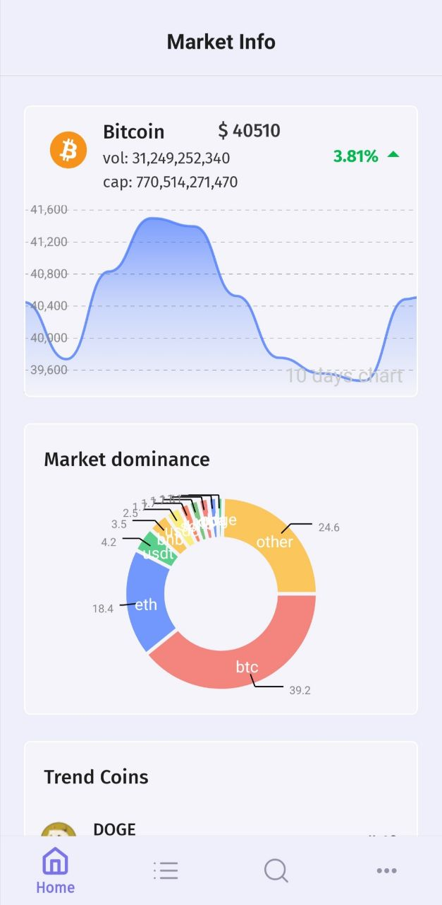
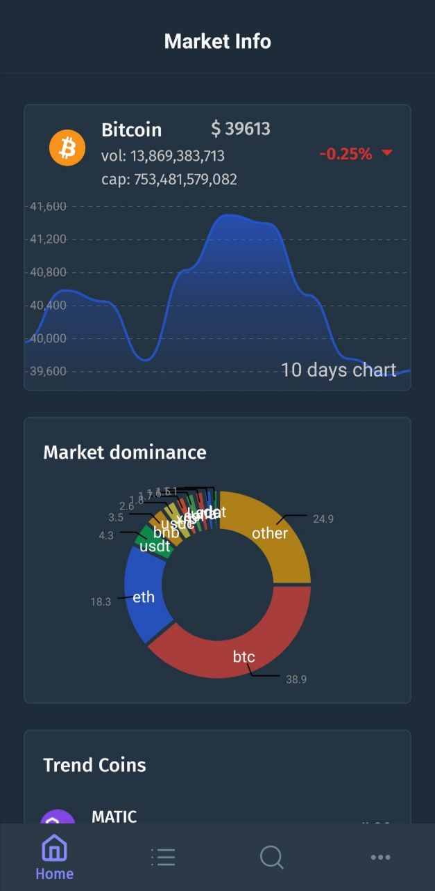
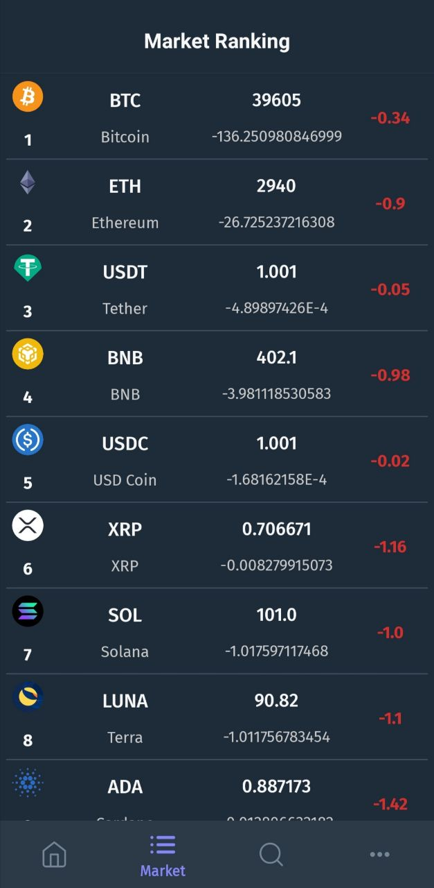
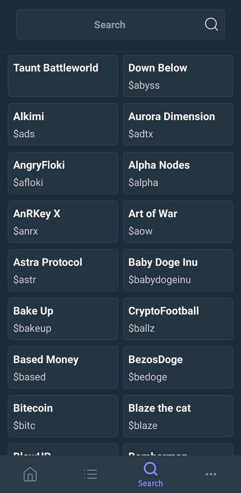

### Geckoin
Geckoin is a cryptocurrency simple app for basic market info, top coins list and search in all available tokens by consuming "CoinGecko" API.
In this sample project I tried to develop a standard and modern android app with best practices and some the most useful jetpack components.  

  
  
  
  

### Features
* Kotlin
* Clean Architecture MVVM design pattern
* Offline-First with repository pattern(all screens except coin details page)
* Kotlin Coroutines & Flows for concurrency, observer pattern and data streaming.
* ViewBinding: I preferred viewbinding to databinding because of code rigidity and and easier path to migrate to jetpack compose.
* Room & DataStore For data persistence and caching. 
* Dagger Hilt for dependency injection. 
* WorkManager for background task and synchronizing coins database.
* Paging 3.0: for pagination with offline support. 
* Light/Dark Mode and Material design
* OkHttp and Retrofit with coroutines for networking
* MPAndroidCharts for charts
* Coil for image loading
* Network Response Adapter for handling different api response types (https://github.com/haroldadmin/NetworkResponseAdapter).
* CoinGecko Free Api: All data provided by coingecko public api (https://www.coingecko.com/en)

***video shot link***: https://youtube.com/shorts/pl28XA9hnvE?feature=share

<!-- 
https://youtu.be/pl28XA9hnvE?t=2 -->

